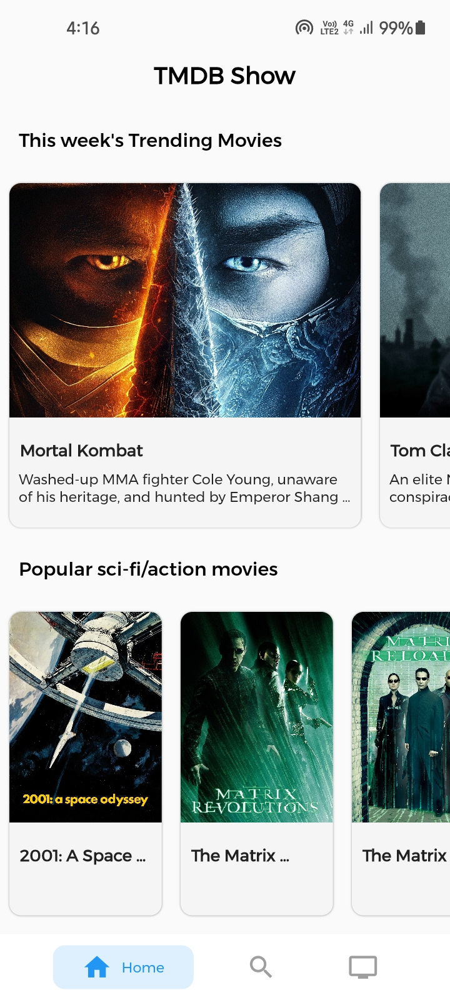
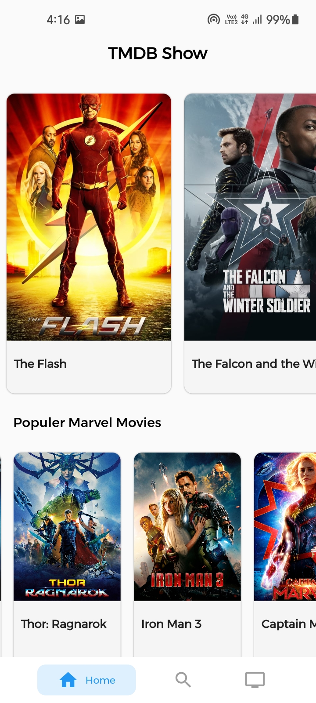
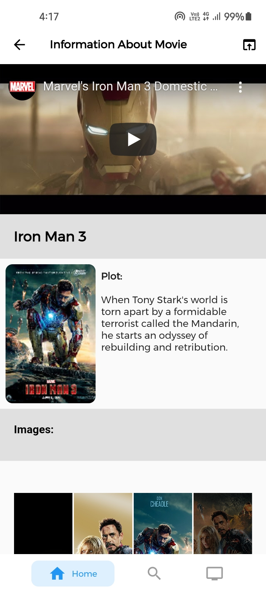
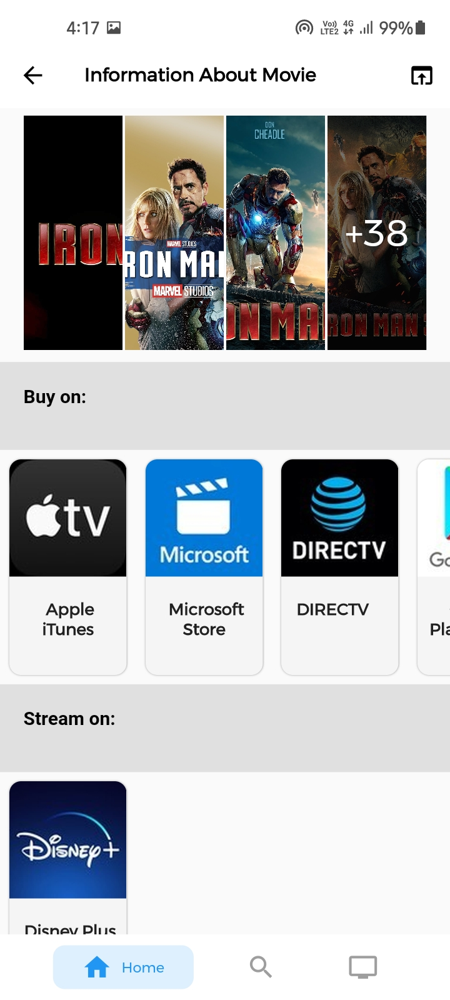
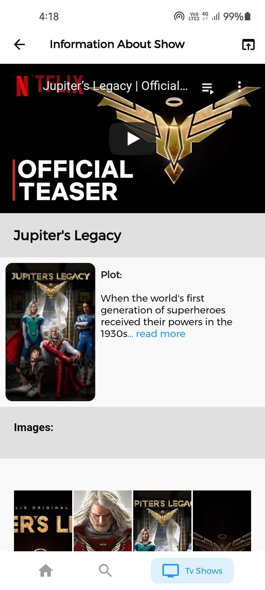
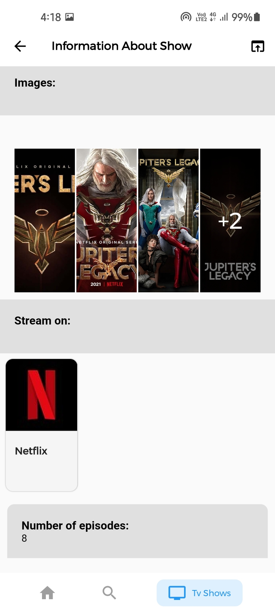
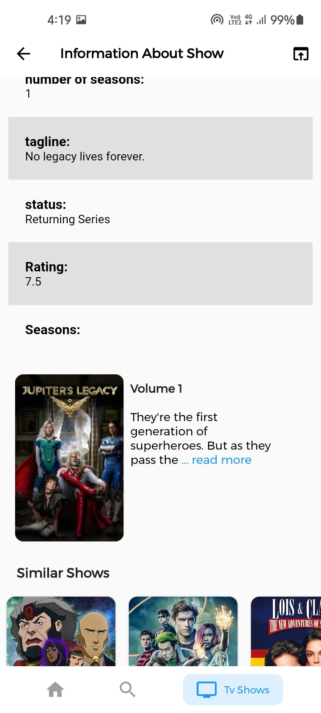
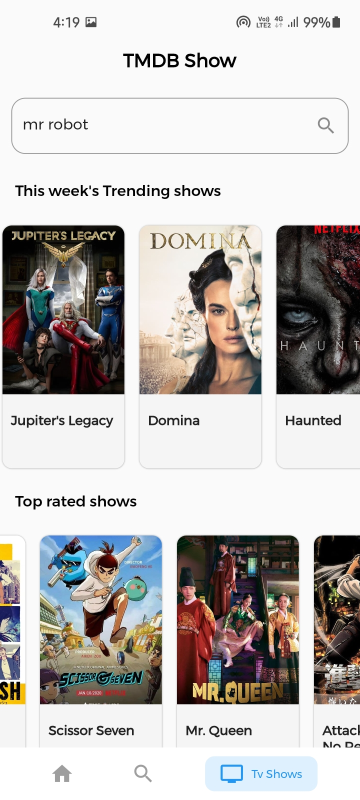
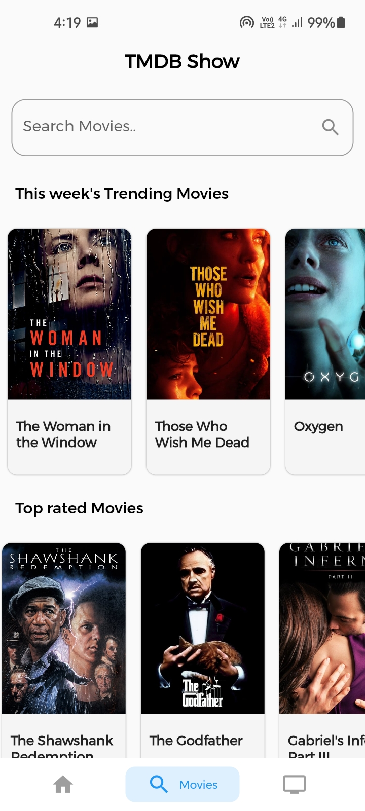

# movies

A new Flutter project.

- with firebase and TMDB API[(The Movie Database api)](https://developers.themoviedb.org/3).
- The app contains all movies\shows info and their video trailers.

<br>
<br>

## Packages used

- cached_network_image: ^3.0.0
- cloud_firestore: ^2.1.0
- cupertino_icons: ^1.0.2
- equatable: ^2.0.0
- flutter_bloc: ^7.0.0
- flutter_spinkit: ^5.0.0
- flutter_widget_from_html: ^0.6.1
- google_fonts: ^2.0.0
- http: ^0.13.3
- persistent_bottom_nav_bar: ^4.0.2
- photo_view: ^0.11.1
- readmore: ^1.0.1
- url_launcher: ^6.0.3

  <br>
  <br>

## Screenshots

 <br>
  
<p align="center">









</p>

## How to use

To clone and run this application, you'll need [Git](https://git-scm.com/downloads) and [Flutter](https://flutter.dev/docs/get-started/install) installed on your computer. From your command line:

```
# Clone this repository
$ git clone https://github.com/Appii00/Flutter-Bloc-Movies-App

# Go into the repository
$ cd Flutter-Bloc-Movies-App

# Install dependencies
$ flutter packages get

# Run the app
$ flutter run
```

**Download _.apk_ file from [Here](https://mega.nz/file/381GnbwL#RTCqgC-ky9e2LGf1p4JS4ipE_kIlqrt1cMPWBonw3AI)**
